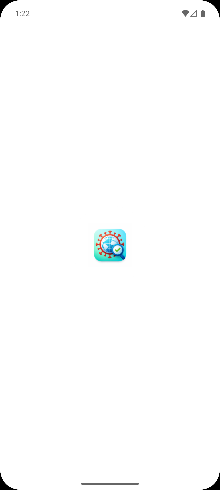
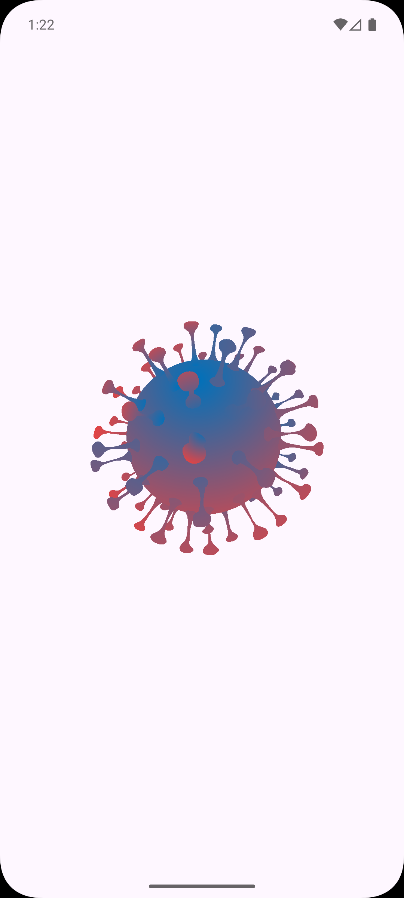
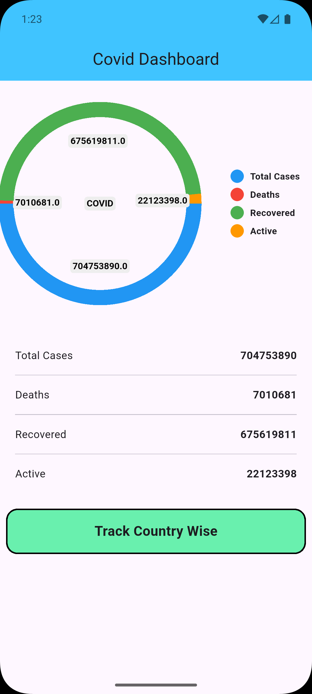
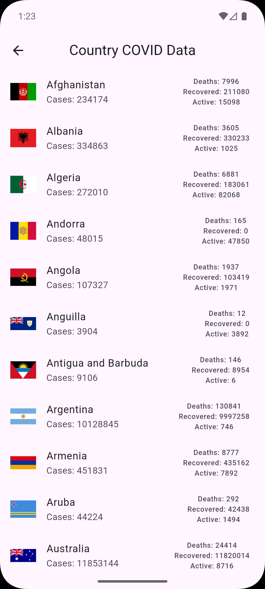
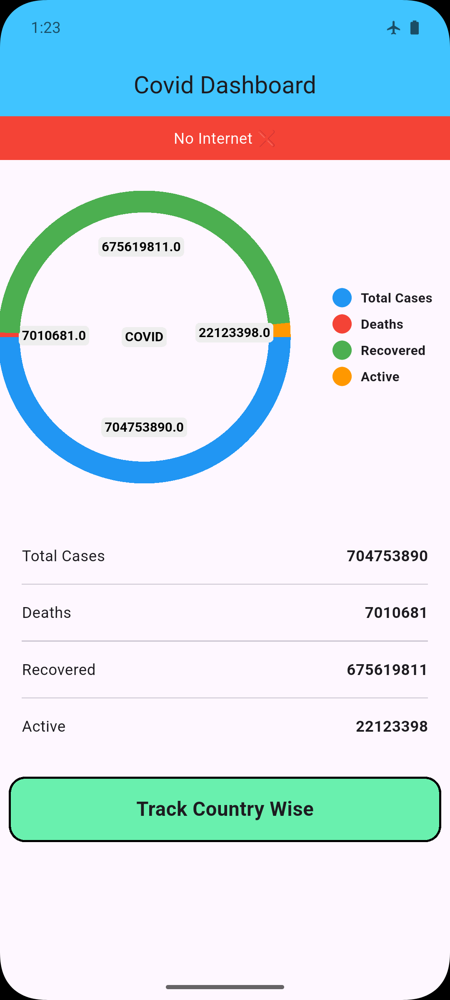

# 🦠 COVID-19 Tracker App (Flutter + GetX)

A modern, high-performance COVID-19 tracking mobile application built using Flutter. This app provides real-time global and country-wise COVID-19 statistics with an intuitive UI, responsive design, and robust state management.

---

## 🚀 Features

### ✨ Core Functionality

* 📊 **Real-Time COVID-19 Data**

  * Integrated REST API to fetch live global statistics
* 🌍 **Country-wise Data Tracking**

  * Detailed breakdown of cases, deaths, recovered, and active cases per country
* 📈 **Interactive Chart Visualization**

  * Implemented using third-party chart library for clear data representation

---

### ⚡ Performance & Architecture

* 🔄 **GetX State Management**

  * Lightweight and efficient state handling
  * Eliminates unnecessary rebuilds for better performance
* 🧠 **Clean Project Structure**

  * Well-organized folders (Controllers, Screens, Services)
  * Scalable and maintainable architecture

---

### 🌐 Connectivity Handling

* 📡 **Network Connectivity Detection**

  * Uses third-party libraries to monitor real-time internet status
  * Displays offline banner when no internet is available

---

### 🎨 UI/UX Design

* 📱 **Responsive UI**

  * Fully adaptive layout for mobiles and tablets
* 🎬 **Splash Screen with Lottie Animation**

  * Smooth and engaging startup experience
* 💡 **Modern UI Components**

  * Clean design with proper spacing and readability

---

## 🛠️ Tech Stack

* **Framework:** Flutter
* **Language:** Dart
* **State Management:** GetX
* **API:** REST API (COVID-19 Data)
* **Charts:** Pie Chart (Third-party package)
* **Animations:** Lottie
* **Connectivity:** connectivity_plus, internet_connection_checker_plus

---

## 📸 App Preview

<h2 align="center">📱 Application Screenshots</h2>

<p align="center">
  
  
  
</p>

<p align="center">
  
  
</p>
---

<h2 align="center">🎥 App Demo Video</h2>

<p align="center">
  <video src="screenshots/demo.mp4" width="700" controls></video>
</p>

---

## 📂 Project Structure

```
lib/
│
├── controller/
│   ├── covid_controller.dart
│   ├── country_controller.dart
│   └── internet_controller.dart
│
├── screens/
│   ├── splash/
│   ├── covidpage.dart
│   └── countryList_screen.dart
│
├── services/
│   └── api_services.dart
│
└── main.dart
```

---

## ⚙️ Installation

1. Clone the repository:

```bash
git clone https://github.com/your-username/covid19-tracker.git
```

2. Navigate to project:

```bash
cd covid19-tracker
```

3. Get dependencies:

```bash
flutter pub get
```

4. Run the app:

```bash
flutter run
```

---

## 🔗 API Source

* COVID-19 Data API: [https://disease.sh/](https://disease.sh/)

---

## 💡 Future Enhancements

* 🔍 Search and filter countries
* 🌙 Dark mode toggle
* 📶 Offline data caching
* 🔔 Notifications for updates
* 📊 More advanced analytics charts

---

## 🤝 Contributing

Contributions are welcome! Feel free to fork this repository and submit a pull request.

---

## 📄 License

This project is licensed under the MIT License.

---

## 👨‍💻 Developer

**Yogesh Makwana**
Flutter Developer


